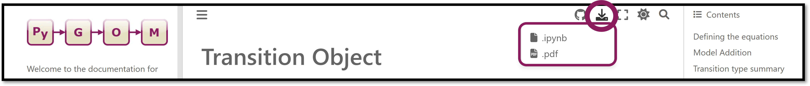

# Welcome to the documentation for PyGOM

## What does this package do?

PyGOM (Python Generic ODE Model) is a Python package which provides a simple interface for users to construct Ordinary Differential Equation (ODE) models, with a focus on compartmental models and epidemiology.
This is backed by a comprehensive and easy to use tool–box implementing functions to easily perform common operations such as parameter estimation and solving for deterministic or stochastic time evolution.
The package source is freely available (hosted on [GitHub](https://github.com/ukhsa-collaboration/pygom)) and organized in a way that permits easy extension. With both the algebraic and numeric calculations performed automatically (but still accessible), the end user is freed to focus on model development.

## What is new in this release?

The main objective of the current release (0.1.8) is to provide more comprehensive documentation on how to use PyGOM.

The code underlying PyGOM's functionality is largely unchanged since the previous release, barring a few minor bug fixes.
The only significant changes which previous users should be aware of are:
- A move away from the {class}`DeterministicOde` class for deterministic simulations and instead employing {class}`SimulateOde` as our do-all class for deterministic or stochastic simulations as well as parameter fitting.
- Running simulations with random parameters does not require a special simulation function. Instead, PyGOM now recognises the parameter types handed to it (fixed or random) and acts accordingly. This means that stochastic simulations can now be performed with random parameters.

Both these changes are outlined in more detail in the {doc}`Producing forecasts <solving>` section.

## Using this documentation
This documentation is built using [JupyterBook](https://jupyterbook.org/en/stable/intro.html).
Instructions on how to build the documentation locally and where to find it can be found {doc}`here <building_doc>`.
To use the contents of a notebook as a starting point for trialling or developing your own models and analyses, you can download any of the examples within this documentation by using the download icon on the desired page (located at the top right).

## Contributing to PyGOM

Please see the [contribution guidance](https://github.com/ukhsa-collaboration/pygom/blob/master/CONTRIBUTING.md) which outlines:
- Required information for raising issues
- The process by which code contributions should be incorporated
- What is required by pull requests to PyGOM, including how to add to the documentation
- How we will acknowledge your contributions
